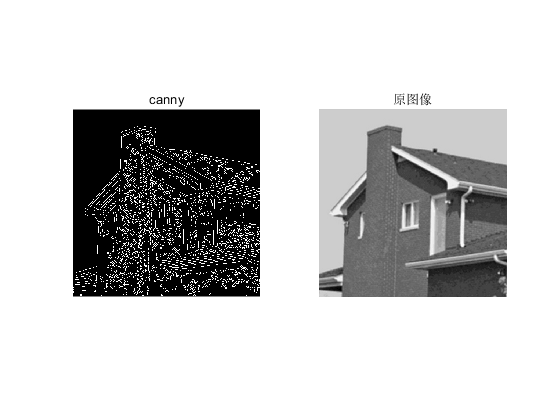

# 数字图像处理第四次作业——空间滤波 #

班级：自动化64 
姓名：丁鹏 
学号：2160504091 
提交日期：2019.3.17

------------------
### 摘要： ###
##### 一、空域低通滤波器：分别用高斯滤波器和中值滤波器去平滑测试图像test1和2，模板大小分别是3x3 ， 5x5 ，7x7； 分析各自优缺点； #####
1. 问题分析：空域滤波是直接对图像的数据做空间变换达到滤波的目的。它是一种邻域运算,其机理就是在待处理的图像中逐点地移动模板,滤波器在该点地响应通过事先定义的滤波器系数与滤波模板扫过区域的相应像素值的关系来计算。如果输出像素是输入像素邻域像素的线性组合则称为线性滤波(例如最常见的均值滤波和高斯滤波),否则为非线性滤波(中值滤波、边缘保持滤波等)。

2. 处理结果: 
1). 高斯滤波器-test1

2). 高斯滤波器-test2

3). 中值滤波器-test1

4). 中值滤波器-test2

结果分析：高斯滤波器是一种平滑线性滤波器，使用高斯滤波器对图像进行滤波，其效果是降低图像灰度的“尖锐”变化，也就是使图像“模糊”了。高斯滤波对于抑制服从正态分布的噪声效果非常好，其代价是使图像变得“模糊”。当然，有时对图像进行平滑滤波的目的就是让图像变得模糊。中值滤波器的主要功能是使拥有不同灰度的点更接近于它的相邻点。从处理后的图像看,图像的平滑效果较为明显,且受窗口的影响,窗口越大,平滑效果越明显,图像细节越模糊,尤其是test2中人脸图像的眼睛部分,随着滤波器模板的增大,可以明显的感受到图像模糊的效果。

##### 二、利用固定方差 sigma=1.5产生高斯滤波器. 附件有产生高斯滤波器的方法； 分析各自优缺点； #####
1. 问题分析：高斯滤波是一种根据高斯函数的形状来选择模板权值的线性平滑滤波方法。高斯平滑滤波器对去除服从正态分布的噪声是很有效果的。一维零均值高斯函数为。其中,高斯分布参数决定了高斯滤波器的宽度。

2. 处理结果: 
1). test1

2). test2

结果分析：高斯滤波是一种线性平滑滤波,适用于消除高斯噪声,广泛应用于图像处理的减噪过程。从处理后的图像看,图像的平滑效果较为明显,且受窗口的影响,窗口越大,平滑效果越明显,图像细节越模糊。

##### 三、利用高通滤波器滤波测试图像test3,4：包括unsharp masking, Sobel edge detector, and Laplace edge detection；Canny algorithm.分析各自优缺点； #####
1. 问题分析：图像测试主要包括： 
反锐化掩膜图像增强（unsharpmasking） 
Sobel算子（Sobel operater）主要用作边缘检测，在技术上，它是一离散性差分算子，用来运算图像亮度函数的灰度之近似值。在图像的任何一点使用此算子，将会产生对应的灰度矢量或其法矢量。 
Laplace边缘检测（Laplace edge detection）是最简单的各项同性微分算子，具有旋转不变形。 
Canny算子（Canny algorithm） 

2. 处理结果: 
1). test3

2). test4

结果分析： 
非锐化掩膜处理结果得到了边缘更加清晰的图像，与预期改进效果一致。但同时看到也会引进一些不希望看到的噪声。  
Sobel是图像处理中的算子之一，主要用作边缘检测。在在图像的任何一点使用此算子，将会产生对应的梯度矢量或是其法矢量。由于Sobel算子是滤波算子的形式，用于提取边缘，可以利用快速卷积函数，简单有效，因此应用广泛。 
Laplace是一种微分算子，其应用强调的是图像中灰度的突变，并不强调灰度级缓慢变化的区域。这将产生把浅灰色边线和突变点叠加到暗色背景中的图像。结合处理后的图像观察，拉普拉斯算子对于test3_corrupt.pgm的边沿检测较为理想，而对于test4 copy.bmp的边缘检测不是很理想，但是经过滤波后在检测可以得到一定的改善。 
Canny算子可以很好的将图像的边缘提取出来。 

